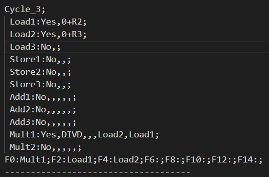

# <center>中山大学计算机学院计算机体系结构本科生实验报告

> <center>（2022学年春季学期）
## 一.实验题目
- 使用自己熟悉的编程语言（eg：C/C++/Java/Pyhon）实现 Tomasulo 算法，并利用Tomasulo算法给出给定指令集执行顺序
- 编写的程序还需输出每个 cyle 下的 instruction status, reservation status, load buffer status 和 register result  status， 输出的格式参考文档附件说明


## 二.机器配置

#### 1.基本设置

参照课本Figure 3.6进行机器实现


- 功能单元不是流水线式的

- 功能单元间不转发，全通过CDB

- EX阶段同时计算有效地址及load和store的内存访问，流水线为IF/ID/IS/EX/WB

- 指令流出(IS)和写回(WB)阶段各需要1周期

- 浮点操作执行时间

  | FP Instruction | EX Cycles |
  | :------------: | :-------: |
  |      fadd      |     2     |
  |      fsub      |     2     |
  |     fmult      |    10     |
  |      fdiv      |    20     |

- 读写内存执行时间

  | Operation | EX Cycles |
  | :-------: | :-------: |
  |    LD     |     2     |
  |    SD     |     2     |

- Load/Store缓冲器、保留站、寄存器数目

  | Reservation | Number |
  | :---------: | :----: |
  |    Load     |   3    |
  |    Store    |   3    |
  |     Add     |   3    |
  |    Mult     |   2    |
  |     Reg     |   8    |

#### 2.输入输出

- 输入：指令集的txt文本名称
- 输出：以"output-输入名称最后一个字符"命名的txt文本


## 三.部分代码描述

> #### PS：代码均已详细注释，除部分需要强调说明，其余不再赘述

#### 1.指令及功能单元组件结构体

##### 指令集

```c++
struct Instuction{
    vector<string> ins;  //指令内容
    int issue = 0;  //指令发射周期
    int exec = 0;   //指令执行周期
    int wb = 0;     //指令写回周期
};
```

- 当issuse、exec、wb均非0代表指令执行完毕

##### Load缓冲器

```c++
struct Load{
    int busy = 0;   //是否忙
    int Fu = -1;    //load目的寄存器
    string  src = "";   //load数据来源，如34+R3
    int no_of_ins = 0;  //当前执行指令编号
    int cycles_ins = 0;  //当前指令需要执行周期数
    int exe_done = 0;    //指令执行完毕，可以写回
};
```

##### Store缓冲器

```c++
struct Store{
    int busy = 0;   //是否忙
    string addr = "";    //store目的地,如0+R1
    string Vk = "";     //store操作数值
    string Qk = "";    //store操作数来源
    int no_of_ins = 0;  //当前执行指令编号
    int cycles_ins = 0;  //当前指令需要执行周期数
    int issue_done = 0 ; //数据准备完毕，可以执行，开始计算时延
    int exe_done = 0;    //执行结束，可以写回
}
```

##### Add或Mult保留站

```c++
struct AoM
{
    int busy = 0;   //是否忙
    string op = "";     //操作
    string Vj = "";     //第一个操作数值
    string Vk = "";     //第二个操作数值
    string Qj = "";     //第一个操作数值来源
    string Qk = "";     //第二个操作数值来源
    string res = "";     //运算结果
    int des = -1;   //结果写入寄存器号
    int no_of_ins = 0;  //当前执行指令编号
    int cycles_ins = 0;  //当前指令需要执行周期数
    int issue_done = 0 ; //数据准备完毕，可以执行，开始计算时延
    int exe_done = 0;    //执行结束，可以写回
}
```

##### 寄存器

```c++
struct Register{
    string value = "";  //寄存器值
    string source = "";     //值的来源
    int wb_done = 1;    //1代表也被写到CBD，即数据准备完毕
};
```


#### 2.机器类封装

```c++
class myMachine
{
private:
    vector<Load> Load;   //Load缓冲器
    vector<Store> Store;  //Store缓冲器
    vector<AoM> Add;    //Add保留站
    vector<AoM> Mult;   //Mult保留站 
    vector<Instuction> Ins; //指令集
    vector<Register> Reg;   //寄存器组
    vector<pair<string, string> > CBD;   //公共数据总线，第一个string为数据来源，第二个为数据
    int cycle;  //时钟周期
    int finish; //完成指令数
    //各个组件空闲状态,0:Load 1:Store 2:Add 3:Mult 
    vector<int> spare;   
    vector<string> filname_output;  //输出文件名,用于分文件输出
    enum cycles{        //各项操作耗费周期数
        IS = 1, //issue
        WB = 1, //write back
        LD = 2, //load 
        SD = 2, //store
        fadd = 2,   //float add
        fsub = 2,   //float sub
        fmult = 10, //float mult
        fdiv = 20   //float div
    };   
public:
    myMachine(); 
    //机器客制化，na:Add数量，nm:Mult数量，nl:Load数量，ns:Store数量，nr:Reg数量
    myMachine(int na, int nm, int nl, int ns, int nr);
    void getInstuction(string put);   //获取指令集
    void exportResult_cycle(string put);      //文本输出每个周期状态
    void exportResult_final(string put);      //文本输出最终结果
    vector<int> get_index_of_reg_from_ins(int pc);   //从指令获取寄存器标号
    string get_from_CBD(char f, char b);  //从CBD取结果
    //Tomasulo算法
    void Issue(int PC);   //指令流出
    void Exec(int PC);    //指令执行
    void WriteBack(int PC);      //结果写回
    void Tomasulo(string put);  //算法执行,put输入指令集文件 
};
```


#### 3.Tomasulo算法实现

##### 算法执行

```c++
void myMachine::Tomasulo(string put){
    。。。。。。
    int PC = 0; //当前运行指令
    //遍历指令集来执行所有指令
    while (finish != Ins.size())
    {
        cycle ++;	//下一个周期
        for (int i = 0; i < Ins.size(); i++)
        {   
            if (Ins[i].wb == 0)     //结果写回
            {
                WriteBack(i);	//写回
            }
            if ((i == 0) && (Ins[0].issue == 0))	//防止i-1数组越界
            {
                Issue(0);
                break;
            }else if ((Ins[i].issue == 0) && (Ins[i - 1].issue != 0))  //指令必须按顺序读取
            {
                Issue(i);   //指令流入
                break;      //一个周期只流入一条指令
            } 
            if (Ins[i].exec == 0)   //指令运行
            {
                Exec(i);	//指令执行
            }    
        }    
        。。。。。。
    }
    。。。。。。
}
```

- 略去了指令集文本读取和输出处理部分
- 指令一次只能从指令集流出一次，所以每流出一条指令就需要跳出循环。
- 指令流出必须确保上一条指令已经流出，可根据指令的流出周期判断
- 虽然算法的步骤应该是先指令流出，再执行，最后写回。但是实际执行时，指令流出会跳出循环，若最开始就执行流出，导致执行和写回跳过，所以对函数顺序进行调整，**但是算法的实际执行顺序还是指令流出、执行、写回。**因为就算先执行Exec函数，也会因为没有数据而返回。

###### 指令流出

```c++
void myMachine::Issue(int PC){  
    Instuction process_ins = Ins[PC];
    int no_reg = 0;    //store的来源寄存器标号，其余的目的寄存器标号
    。。。。。。	//省略掉了no_reg的获取
    //指令判断  
    if ((Ins[PC].ins[0] == "LD") && (spare[0] != 0))    //load运算且缓冲器有位置
    {
        int i_for_L;    //缓冲器单元号
        //装入load缓冲器
        for (int i = 0; i < Load.size(); i++)
        {	//更改缓冲器值
            if (Load[i].busy != 1)
            {
                。。。。。。		//省略更改过程
                i_for_L = i;     //缓冲器单元号
                spare[0] --;       //占用一个单元
                break;
            }
        }
        //更新目的寄存器
        Reg[no_reg].wb_done = 0;    //寄存器未准备就绪
        Reg[no_reg].value = "";
        string temp = "Load";
        Reg[no_reg].source = temp + char((i_for_L + 1) + '0'); //寄存器数据来源
        for (int i = 0; i < CBD.size(); i++)    //删除总线已有的保留站的值
        {
            。。。。。。	//省略删除过程
        }
        Ins[PC].issue = cycle;        //指令的IS周期
    }else if ((Ins[PC].ins[0] == "SD") && (spare[1] != 0))   //store运算且缓冲器有位置
    {
       。。。。。。	//省略SD指令的流出
    }else if (((Ins[PC].ins[0] == "ADDD") || (Ins[PC].ins[0] == "SUBD")) && (spare[2] != 0))     //+-运算
    {
        //第一和第二操作数的寄存器
        vector<int> tempi= get_index_of_reg_from_ins(PC);
        int first_opnum = tempi[0], second_opnum = tempi[1];
        int i_for_A;    //保留站标号
        for (int i = 0; i < Add.size(); i++)
        {	//更改保留站值
            if (Add[i].busy != 1)
            {
                。。。。。。	//省略更改过程
                spare[2] --;       //占用一个单元
                break;
            }
        }
        //判断第一个操作数是否准备完毕
        if (Reg[first_opnum].wb_done)
        {   //准备完毕，V填入值，Q清空
            Add[i_for_A].Vj = Reg[first_opnum].value;
            Add[i_for_A].Qj = "";
        }else{  //没准备好，替换寄存器为对应保留站的标号
            Add[i_for_A].Qj = Reg[first_opnum].source;
        }
        //判断第二个操作数是否准备完毕
        if (Reg[second_opnum].wb_done)
        {   //准备完毕，V填入值，Q清空
            Add[i_for_A].Vk = Reg[second_opnum].value;
            Add[i_for_A].Qk = "";
        }else{  //没准备好，替换寄存器为对应保留站的标号
            Add[i_for_A].Qk = Reg[second_opnum].source;
        }
        //更新目的寄存器
        Reg[no_reg].wb_done = 0;    //寄存器未准备就绪
        Reg[no_reg].value = "";
        string temp ="Add";
        Reg[no_reg].source = temp + char((i_for_A + 1) + '0'); //寄存器数据来源
        for (int i = 0; i < CBD.size(); i++)    //删除总线已有的保留站的值
        {
             。。。。。。	//省略删除过程
        }
        // 如果指令载入时，数据已经准备好，直接开始计算延时
        if ((Add[i_for_A].issue_done == 0) && (Add[i_for_A].Vj != "") && (Add[i_for_A].Vk != "")) //准备就绪，开始计算时延
        {
            。。。。。。 //省略计算时延
            Add[i_for_A].issue_done = 1;	//代表准备完毕，可以进入执行阶段
        }
        Ins[PC].issue = cycle;        //指令的IS周期
    }else if (((Ins[PC].ins[0] == "MULTD") || (Ins[PC].ins[0] == "DIVD")) && (spare[3] != 0))    //*/运算
    {
        。。。。。。 //省略MULTD指令
    }
}
```

- 因报告篇幅有限，因为Mult与Add代码结构相同，Store有一个操作数，所以也和Add相同，以Load指令和Add指令为例说明，余下省略，**省略部分均有注释说明(仅在报告中省略，详细代码与注释在源码文件中)**

- 整体流程就是：

  > 1. 找到缓冲器/保留站空闲单元
  > 2. 更新保留站数据
  > 3. 更新目标寄存器
  > 4. 更新就续的操作数
  > 5. 若操作数全就绪，开始计算时延
  > 6. 指令附上issue周期

  - 其中Store不需要写入寄存器，即没有步骤3；Load不需要操作数准备，即没有步骤4、5

- 余下内容，代码均有详细注释，便不再赘述

###### 操作执行

```c++
void myMachine::Exec(int PC){
    //遍历所有保留站和缓冲器,执行对应指令
    。。。。。。	//省略Load和Store
    //遍历ADD保留站
    for (int i = 0; i < Add.size(); i++)
    {   //延迟已过且两个操作数均已准备好才可执行
        if ((Add[i].busy == 1) && (Add[i].cycles_ins == cycle) && (Add[i].Qj == "") && (Add[i].Qk == ""))
        {
            //计算结果
            if (Add[i].op == "ADDD")
            {   
                string temp = "+";
                Add[i].res = Add[i].Vj + temp + Add[i].Vk;   //加法运算
            }else{
                string temp = "-";
                Add[i].res = Add[i].Vj + temp + Add[i].Vk;   //减法运算
            }
            Add[i].exe_done = 1;    //计算完毕，可以写回
            Add[i].cycles_ins += WB;   //加上写回的周期
            Ins[Add[i].no_of_ins].exec = cycle;   //指令执行周期
        }
    }
   。。。。。。	//省略Mult过程
}
```

- 因报告篇幅有限，操作执行阶段都差不多，以Add为例，余下省略，**省略部分均有注释说明(仅在报告中省略，详细代码与注释在源码文件中)**

- 整体流程：

  > 1. 找到延时计算完毕、存有数据、操作数全部准备完毕(如果有)的缓冲器/保留站单元
  > 2. 计算结果并存入
  > 3. 开始计算写回延时
  > 4. 指令附上exec周期

- 余下内容，代码均有详细注释，便不再赘述

###### 写回阶段

```c++
void myMachine::WriteBack(int PC){
    //保留站执行完毕，即CDB准备就绪，操作完成
    //将等待结果的寄存器填上结果
    //通过遍历所有缓冲器和保留站可写回单元实现
    。。。。。。	//省略Load和Store
    //Add保留站
    for (int i = 0; i < Add.size(); i++)
    {
        //代表数据准备写回
        if ((Add[i].exe_done == 1) && (Add[i].busy == 1) && (Add[i].cycles_ins == cycle))  
        {
            //若有更新的指令的值占用了该寄存器，则不更新寄存器，只写CBD
            if (Reg[Add[i].des].wb_done == 0)
            {
                Reg[Add[i].des].value = Add[i].res;//写结果到寄存器
                Reg[Add[i].des].source = "";
                Reg[Add[i].des].wb_done = 1;    //寄存器准备就绪
            }
            Ins[Add[i].no_of_ins].wb = cycle;  //指令的写回周期
            string temp = "Add";
            CBD.push_back(make_pair(temp + char((i + 1) + '0'), Add[i].res));  //结果存入CBD
            Add[i].ini();  //重置保留站
            spare[2] ++;
            finish ++;  //写回后，代表指令完成
        }
        //数据不能写回，但是准备好操作数操作要更新
        if ((Add[i].busy == 1) && (Add[i].exe_done == 0))
        {   
            //第一操作数更新
            if (Add[i].Vj == "")
            {
                char ri1 = Add[i].Qj.back();     //来源缓冲器或保留站编号
                Add[i].Vj = get_from_CBD(Add[i].Qj[0], ri1); //填上需要数据,从CBD取
                if (Add[i].Vj != "")  Add[i].Qj = "";   //Qk置空
            }
            //第二操作数更新
            。。。。。。	//省略更新过程，因为和更新第一操作数
        }
        if ((Add[i].issue_done == 0) && (Add[i].Vj != "") && (Add[i].Vk != "")) //准备就绪，开始计算时延
        {
            。。。。。。	//省略计算，因为和Issue中一样
            Add[i].issue_done = 1;
        }
    }
    。。。。。。	//省略Mult
}
```

- 因报告篇幅有限，写回阶段都差不多，以Add为例，余下省略，**省略部分均有注释说明(仅在报告中省略，详细代码与注释在源码文件中)**

- 整体流程：

  > 1. 找到延时计算完毕、存有数据、操作执行完毕的缓冲器/保留站单元
  > 2. 计算结果并CDB和寄存器，如果在计算期间目的寄存器有新的寄存器值占用，则不更新寄存器
  > 3. 更新其他需要该单元值的缓冲器/保留站单元
  > 4. 更新后，若操作数全就绪，开始计算时延
  > 5. 指令附上wb周期
  > 6. 指令执行完毕

  - 步骤4和指令流出中一致

- 余下内容，代码均有详细注释，便不再赘述


> #### 余下代码便是一些工具的实现，便不再赘述


## 四.实验结果及分析

> #### PS：为验证程序正确性，以下对所给的两个input的运行结果按周期进行分析。
>
> #### PPS：分析效仿"Chap03-ILP-Part3-TomasuloExample"PPT第22页的图表。
>
> #### PPPS：但因为篇幅有限，每3个需要说明的周期画一次表格，并在对应表项后加上"[n]"，n代表对应周期数；xxx[n]->xxx[n+j]，代表同一个图表内的内容变换

#### input1

##### 结果截图与分析：Cycle_1~3

|          Cycle_1           |           Cycle_2           |           Cycle_3           |
| :------------------------: | :-------------------------: | :-------------------------: |
|  |  |  |

- 前两个周期，`LD`进行判断是否有Load缓冲器空闲，若有则占据。因为`LD`指令不需要操作数，所以一旦`Issue`就可以直接进行计算延时，从而进入`Execute`。

- 第三个周期导入`MULTD`指令，因为需要2个操作数，所以进入等待状态，等待操作数就位；Load1执行完毕，进入`Execute`

  - ##### Cycle_1~3表格

    > > #####  Instruction Status
    >
    > |  Instruction   | Issue | Execute | Write Result |
    > | :------------: | :---: | :-----: | :----------: |
    > |  LD F6 34+ R2  |   1   |    3    |              |
    > |  LD F2 45+ R3  |   2   |         |              |
    > | MULTD F0 F2 F4 |   3   |         |              |
    > | SUBD F8 F6 F2  |       |         |              |
    > | DIVD F10 F0 F6 |       |         |              |
    > | ADDD F6 F8 F2  |       |         |              |
    >
    > > ##### Reservation Stations
    >
    > |  Name  | Bussy  |    Op    |  Vj  |   Vk    |    Qj    |  Qk  | Address  |
    > | :----: | :----: | :------: | :--: | :-----: | :------: | :--: | :------: |
    > | Load1  | Yes[1] |  LD[1]   |      |         |          |      | 34+R2[1] |
    > | Load2  | Yes[2] |  LD[2]   |      |         |          |      | 45+R3[2] |
    > | Load3  |   No   |          |      |         |          |      |          |
    > | Store1 |   No   |          |      |         |          |      |          |
    > | Store2 |   No   |          |      |         |          |      |          |
    > | Store3 |   No   |          |      |         |          |      |          |
    > |  Add1  |   No   |          |      |         |          |      |          |
    > |  Add2  |   No   |          |      |         |          |      |          |
    > |  Add3  |   No   |          |      |         |          |      |          |
    > | Mult1  | Yes[3] | MULTD[3] |      | R(4)[3] | Load2[3] |      |          |
    > | Mult2  |   No   |          |      |         |          |      |          |
    >
    > > Register Status
    >
    > | Field |    F0    |    F2    |  F4  |    F6    |  F8  | F10  | F12  | ...  |
    > | :---: | :------: | :------: | :--: | :------: | :--: | :--: | :--: | ---- |
    > |  Qi   | Mult1[3] | Load2[2] |      | Load1[1] |      |      |      | ...  |

##### 结果截图与分析：Cycle_4~6

|          Cycle_4           |           Cycle_5           |           Cycle_6           |
| :------------------------: | :-------------------------: | :-------------------------: |
|  |  |  |

- 第4周期因为Load1执行完毕，并将值写入F6和CDB后，清空Load1；这时`SUBD`指令读入，因为操作数1已经由Load1书写，所以直接填入；Load2等待结束，进入`Execute`

- 第5周期Load2执行完毕，F2更新，清空Load2，并更换Add1和Mult1的Load2；读入`DIVD`指令，填入F6的值作为操作数2的值，操作数1要等待Mult1；

  - Mult1操作数准备就绪，开始计算时延，将在第15周期进入`Execute ` 
  - Add1操作数准备就绪，开始计算时延，将在第7周期进入`Execute ` 

- 第6个周期导入`ADDD`指令，填入已有的Load2，等待Add1

  - ##### Cycle_4~6表格

    > > #####  Instruction Status
    >
    > |  Instruction   | Issue | Execute | Write Result |
    > | :------------: | :---: | :-----: | :----------: |
    > |  LD F6 34+ R2  |   1   |    3    |      4       |
    > |  LD F2 45+ R3  |   2   |    4    |      5       |
    > | MULTD F0 F2 F4 |   3   |         |              |
    > | SUBD F8 F6 F2  |   4   |         |              |
    > | DIVD F10 F0 F6 |   5   |         |              |
    > | ADDD F6 F8 F2  |   6   |         |              |
    >
    > > ##### Reservation Stations
    >
    > |  Name  | Bussy  |    Op    |     Vj      |     Vk      |    Qj    |      Qk       | Address |
    > | :----: | :----: | :------: | :---------: | :---------: | :------: | :-----------: | :-----: |
    > | Load1  | No[4]  |          |             |             |          |               |         |
    > | Load2  | No[5]  |   [5]    |             |             |          |               |   [5]   |
    > | Load3  |   No   |          |             |             |          |               |         |
    > | Store1 |   No   |          |             |             |          |               |         |
    > | Store2 |   No   |          |             |             |          |               |         |
    > | Store3 |   No   |          |             |             |          |               |         |
    > |  Add1  | Yes[4] | SUBD[4]  | M(34+R2)[4] | M(45+R3)[5] |          | Load2[4]->[5] |         |
    > |  Add2  | Yes[6] | ADDD[6]  |             | M(45+R3)[6] | Add1[6]  |               |         |
    > |  Add3  |   No   |          |             |             |          |               |         |
    > | Mult1  | Yes[3] | MULTD[3] | M(45+R3)[5] |   R(4)[3]   |   [5]    |               |         |
    > | Mult2  | Yes[5] | DIVD[5]  |             | M(34+R2)[5] | Mult1[5] |               |         |
    >
    > > Register Status
    >
    > | Field |    F0    |     F2      |  F4  |          F6          |   F8    |   F10    | F12  | ...  |
    > | :---: | :------: | :---------: | :--: | :------------------: | :-----: | :------: | :--: | ---- |
    > |  Qi   | Mult1[3] | M(45+R3)[5] |      | M(34+R2)[4]->Add2[6] | Add1[4] | Mult2[5] |      | ...  |

##### 结果截图与分析：Cycle_7、8、10

|          Cycle_7           |           Cycle_8           |           Cycle_10           |
| :------------------------: | :-------------------------: | :--------------------------: |
|  |  |  |

- 第7周期Add1计算完毕，但还未写回，所以只是标记指令

- 第8周期Add1结果写回CDB和F8，Add1清空，Add2更新

  - Add2操作数准备就绪，开始计算时延，将在第10周期进入`Execute `

- 第10周期， Add2计算完毕，还未写回，仅标记

  - #####  Cycle_7、8、10表格

    > > #####  Instruction Status
    >
    > |  Instruction   | Issue | Execute | Write Result |
    > | :------------: | :---: | :-----: | :----------: |
    > |  LD F6 34+ R2  |   1   |    3    |      4       |
    > |  LD F2 45+ R3  |   2   |    4    |      5       |
    > | MULTD F0 F2 F4 |   3   |         |              |
    > | SUBD F8 F6 F2  |   4   |    7    |      8       |
    > | DIVD F10 F0 F6 |   5   |         |              |
    > | ADDD F6 F8 F2  |   6   |   10    |              |
    >
    > > ##### Reservation Stations
    >
    > |  Name  | Bussy  |    Op    |          Vj          |     Vk      |      Qj      |  Qk  | Address |
    > | :----: | :----: | :------: | :------------------: | :---------: | :----------: | :--: | :-----: |
    > | Load1  |   No   |          |                      |             |              |      |         |
    > | Load2  |   No   |          |                      |             |              |      |         |
    > | Load3  |   No   |          |                      |             |              |      |         |
    > | Store1 |   No   |          |                      |             |              |      |         |
    > | Store2 |   No   |          |                      |             |              |      |         |
    > | Store3 |   No   |          |                      |             |              |      |         |
    > |  Add1  | No[8]  |   [8]    |         [8]          |     [8]     |              |      |         |
    > |  Add2  | Yes[6] | ADDD[6]  | M(34+R2)-M(45+R3)[8] | M(45+R3)[6] | Add1[6]->[8] |      |         |
    > |  Add3  |   No   |          |                      |             |              |      |         |
    > | Mult1  | Yes[3] | MULTD[3] |     M(45+R3)[5]      |   R(4)[3]   |     [5]      |      |         |
    > | Mult2  | Yes[5] | DIVD[5]  |                      | M(34+R2)[5] |   Mult1[5]   |      |         |
    >
    > > Register Status
    >
    > | Field |    F0    |     F2      |  F4  |   F6    |          F8          |   F10    | F12  | ...  |
    > | :---: | :------: | :---------: | :--: | :-----: | :------------------: | :------: | :--: | ---- |
    > |  Qi   | Mult1[3] | M(45+R3)[5] |      | Add2[6] | M(34+R2)-M(45+R3)[8] | Mult2[5] |      | ...  |

##### 结果截图与分析：Cycle_11、15、16

|          Cycle_11           |           Cycle_15           |           Cycle_16           |
| :-------------------------: | :--------------------------: | :--------------------------: |
|  |  |  |

- 第11周期Add2结果写回CDB和F6，Add2清空

- 第15周期， Mult1计算完毕，还未写回，仅标记

- 第16周期Mult1结果写回CDB和F0，更新Mult2，Mult1清空

  - Mult2操作数准备就绪，开始计算时延，将在第36周期进入`Execute `

    ##### Cycle_11、15、16表格

    > > #####  Instruction Status
    >
    > |  Instruction   | Issue | Execute | Write Result |
    > | :------------: | :---: | :-----: | :----------: |
    > |  LD F6 34+ R2  |   1   |    3    |      4       |
    > |  LD F2 45+ R3  |   2   |    4    |      5       |
    > | MULTD F0 F2 F4 |   3   |   15    |      16      |
    > | SUBD F8 F6 F2  |   4   |    7    |      8       |
    > | DIVD F10 F0 F6 |   5   |         |              |
    > | ADDD F6 F8 F2  |   6   |   10    |      11      |
    >
    > > ##### Reservation Stations
    >
    > |  Name  | Bussy  |   Op    |         Vj         |     Vk      |  Qj  |  Qk  | Address |
    > | :----: | :----: | :-----: | :----------------: | :---------: | :--: | :--: | :-----: |
    > | Load1  |   No   |         |                    |             |      |      |         |
    > | Load2  |   No   |         |                    |             |      |      |         |
    > | Load3  |   No   |         |                    |             |      |      |         |
    > | Store1 |   No   |         |                    |             |      |      |         |
    > | Store2 |   No   |         |                    |             |      |      |         |
    > | Store3 |   No   |         |                    |             |      |      |         |
    > |  Add1  |   No   |         |                    |             |      |      |         |
    > |  Add2  | No[11] |         |                    |             |      |      |         |
    > |  Add3  |   No   |         |                    |             |      |      |         |
    > | Mult1  | No[16] |         |                    |             |      |      |         |
    > | Mult2  | Yes[5] | DIVD[5] | M(45+R3)*R(F4)[16] | M(34+R2)[5] | [16] |      |         |
    >
    > > Register Status
    >
    > | Field |       F0       |     F2      |  F4  |               F6               |          F8          |   F10    | F12  | ...  |
    > | :---: | :------------: | :---------: | :--: | :----------------------------: | :------------------: | :------: | :--: | ---- |
    > |  Qi   | M(45+R3)*R(F4) | M(45+R3)[5] |      | M(34+R2)-M(45+R3)+M(45+R3)[11] | M(34+R2)-M(45+R3)[8] | Mult2[5] |      | ...  |

##### 结果截图与分析：Cycle_36、37

|          Cycle_36           |           Cycle_37           |
| :-------------------------: | :--------------------------: |
|  |  |

- 第36周期， Mult2计算完毕，还未写回，仅标记

- 第37周期Mult2结果写回CDB和F10，Mult2清空，所有指令完成，算法结束

  - Cycle_11、15、16表格

  > > #####  Instruction Status
  >
  > |  Instruction   | Issue | Execute | Write Result |
  > | :------------: | :---: | :-----: | :----------: |
  > |  LD F6 34+ R2  |   1   |    3    |      4       |
  > |  LD F2 45+ R3  |   2   |    4    |      5       |
  > | MULTD F0 F2 F4 |   3   |   15    |      16      |
  > | SUBD F8 F6 F2  |   4   |    7    |      8       |
  > | DIVD F10 F0 F6 |   5   |   36    |      37      |
  > | ADDD F6 F8 F2  |   6   |   10    |      11      |
  >
  > > ##### Reservation Stations
  >
  > |  Name  | Bussy  |  Op  |  Vj  |  Vk  |  Qj  |  Qk  | Address |
  > | :----: | :----: | :--: | :--: | :--: | :--: | :--: | :-----: |
  > | Load1  |   No   |      |      |      |      |      |         |
  > | Load2  |   No   |      |      |      |      |      |         |
  > | Load3  |   No   |      |      |      |      |      |         |
  > | Store1 |   No   |      |      |      |      |      |         |
  > | Store2 |   No   |      |      |      |      |      |         |
  > | Store3 |   No   |      |      |      |      |      |         |
  > |  Add1  |   No   |      |      |      |      |      |         |
  > |  Add2  |   No   |      |      |      |      |      |         |
  > |  Add3  |   No   |      |      |      |      |      |         |
  > | Mult1  |   No   |      |      |      |      |      |         |
  > | Mult2  | No[37] |      |      |      |      |      |         |
  >
  > > Register Status
  >
  > | Field |       F0       |     F2      |  F4  |               F6               |          F8          |              F10              | F12  | ...  |
  > | :---: | :------------: | :---------: | :--: | :----------------------------: | :------------------: | :---------------------------: | :--: | ---- |
  > |  Qi   | M(45+R3)*R(F4) | M(45+R3)[5] |      | M(34+R2)-M(45+R3)+M(45+R3)[11] | M(34+R2)-M(45+R3)[8] | (M(45+R3)*R(F4))/M(34+R2)[37] |      | ...  |

##### 指令最终执行情况表


- 最终耗费37周期而不是57是因为DIVD指令耗时20周期而不是PPT例子的40


#### input2

##### 结果截图与分析：Cycle_1~3

|          Cycle_1           |           Cycle_2           |           Cycle_3           |
| :------------------------: | :-------------------------: | :-------------------------: |
|  |  |  |

- 前两个周期，`LD`进行判断是否有Load缓冲器空闲，若有则占据。因为`LD`指令不需要操作数，所以一旦`Issue`就可以直接进行计算延时，从而进入`Execute`。

- 第三个周期导入`DIVD`指令，因为需要2个操作数，所以进入等待状态，等待操作数就位；Load1执行完毕，进入`Execute`

  - ##### Cycle_1~3表格

    > > #####  Instruction Status
    >
    > |  Instruction   | Issue | Execute | Write Result |
    > | :------------: | :---: | :-----: | :----------: |
    > |   LD F2 0 R2   |   1   |    3    |              |
    > |   LD F4 0 R3   |   2   |         |              |
    > | DIVD F0 F4 F2  |   3   |         |              |
    > | MULTD F6 F0 F2 |       |         |              |
    > | ADDD F0 F4 F2  |       |         |              |
    > |   SD F6 0 R3   |       |         |              |
    > | MULTD F6 F0 F2 |       |         |              |
    > |   SD F6 0 R1   |       |         |              |
    >
    > > ##### Reservation Stations
    >
    > |  Name  | Bussy  |   Op    |  Vj  |  Vk  |    Qj    |    Qk    | Address |
    > | :----: | :----: | :-----: | :--: | :--: | :------: | :------: | :-----: |
    > | Load1  | Yes[1] |  LD[1]  |      |      |          |          | 0+R2[1] |
    > | Load2  | Yes[2] |  LD[2]  |      |      |          |          | 0+R3[2] |
    > | Load3  |   No   |         |      |      |          |          |         |
    > | Store1 |   No   |         |      |      |          |          |         |
    > | Store2 |   No   |         |      |      |          |          |         |
    > | Store3 |   No   |         |      |      |          |          |         |
    > |  Add1  |   No   |         |      |      |          |          |         |
    > |  Add2  |   No   |         |      |      |          |          |         |
    > |  Add3  |   No   |         |      |      |          |          |         |
    > | Mult1  | Yes[3] | DIVD[3] |      |      | Load2[3] | Load1[3] |         |
    > | Mult2  |   No   |         |      |      |          |          |         |
    >
    > > Register Status
    >
    > | Field |    F0    |    F2    |    F4    |  F6  |  F8  | F10  | F12  | ...  |
    > | :---: | :------: | :------: | :------: | :--: | :--: | :--: | :--: | ---- |
    > |  Qi   | Mult1[3] | Load1[1] | Load2[2] |      |      |      |      | ...  |

##### 结果截图与分析：Cycle_4~6

|          Cycle_4           |           Cycle_5           |           Cycle_6           |
| :------------------------: | :-------------------------: | :-------------------------: |
|  |  |  |

- 第4周期因为Load1执行完毕，并将值写入F2和CDB后，更新Mult1，清空Load1；这时`MULTD`指令读入，因为操作数2已经由Load1书写，所以直接填入；之后等待Mult1

- 第5周期Load2执行完毕，F4更新，清空Load2，并更换Mult1的Load2；读入`ADDD`指令，两个操作数直接准备就绪

  - Add1操作数准备就绪，开始计算时延，将在第7周期进入`Execute ` 
  - Mult1操作数准备就绪，开始计算时延，将在第25周期进入`Execute ` 

- 第6个周期导入`SD`指令，等待Mult2

  - ##### Cycle_4~6表格

    > > #####  Instruction Status
    >
    > |  Instruction   | Issue | Execute | Write Result |
    > | :------------: | :---: | :-----: | :----------: |
    > |   LD F2 0 R2   |   1   |    3    |      4       |
    > |   LD F4 0 R3   |   2   |    4    |      5       |
    > | DIVD F0 F4 F2  |   3   |         |              |
    > | MULTD F6 F0 F2 |   4   |         |              |
    > | ADDD F0 F4 F2  |   5   |         |              |
    > |   SD F6 0 R3   |   6   |         |              |
    > | MULTD F6 F0 F2 |       |         |              |
    > |   SD F6 0 R1   |       |         |              |
    >
    > > ##### Reservation Stations
    >
    > |  Name  | Bussy  |    Op    |     Vj     |     Vk     |    Qj    |  Qk  | Address |
    > | :----: | :----: | :------: | :--------: | :--------: | :------: | :--: | :-----: |
    > | Load1  | No[4]  |          |            |            |          |      |   [4]   |
    > | Load2  | No[5]  |          |            |            |          |      |   [5]   |
    > | Load3  |   No   |          |            |            |          |      |         |
    > | Store1 | Yes[6] |  SD[6]   |            |            | Mult2[6] |      | 0+R3[6] |
    > | Store2 |   No   |          |            |            |          |      |         |
    > | Store3 |   No   |          |            |            |          |      |         |
    > |  Add1  | Yes[5] | ADDD[5]  | M(0+R3)[5] | M(0+R2)[5] |          |      |         |
    > |  Add2  |   No   |          |            |            |          |      |         |
    > |  Add3  |   No   |          |            |            |          |      |         |
    > | Mult1  | Yes[3] | DIVD[3]  | M(0+R3)[5] | M(0+R2)[4] |   [5]    | [4]  |         |
    > | Mult2  | Yes[4] | MULTD[4] |            | M(0+R2)[4] | Mult1[4] |      |         |
    >
    > > Register Status
    >
    > | Field |   F0    |     F2     |     F4     |    F6    |  F8  | F10  | F12  | ...  |
    > | :---: | :-----: | :--------: | :--------: | :------: | :--: | :--: | ---- | ---- |
    > |  Qi   | Add1[5] | M(0+R2)[4] | M(0+R3)[4] | Mult2[4] |      |      |      | ...  |

##### 结果截图与分析：Cycle_7、8、25

|          Cycle_7           |           Cycle_8           |           Cycle_25           |
| :------------------------: | :-------------------------: | :--------------------------: |
|  |  |  |

- 第7周期Add1计算完毕，但还未写回，所以只是标记指令，**因为Mult保留站已经满了，所以第7条指令并不能进入保留站，在其之后的指令也不能流出。即Issue被阻塞**

- 第8周期Add1结果写回CDB和F0，Add1清空，Add2更新

  - Add2操作数准备就绪，开始计算时延，将在第10周期进入`Execute `

- 第25周期Mult1计算完毕，但还未写回，所以只是标记指令

  - ##### Cycle_7、8、25表格

    > > #####  Instruction Status
    >
    > |  Instruction   | Issue | Execute | Write Result |
    > | :------------: | :---: | :-----: | :----------: |
    > |   LD F2 0 R2   |   1   |    3    |      4       |
    > |   LD F4 0 R3   |   2   |    4    |      5       |
    > | DIVD F0 F4 F2  |   3   |   25    |              |
    > | MULTD F6 F0 F2 |   4   |         |              |
    > | ADDD F0 F4 F2  |   5   |    7    |      8       |
    > |   SD F6 0 R3   |   6   |         |              |
    > | MULTD F6 F0 F2 |       |         |              |
    > |   SD F6 0 R1   |       |         |              |
    >
    > > ##### Reservation Stations
    >
    > |  Name  | Bussy  |    Op    |     Vj     |     Vk     |    Qj    |  Qk  | Address |
    > | :----: | :----: | :------: | :--------: | :--------: | :------: | :--: | :-----: |
    > | Load1  | No[4]  |          |            |            |          |      |   [4]   |
    > | Load2  | No[5]  |          |            |            |          |      |   [5]   |
    > | Load3  |   No   |          |            |            |          |      |         |
    > | Store1 | Yes[6] |  SD[6]   |            |            | Mult2[6] |      | 0+R3[6] |
    > | Store2 |   No   |          |            |            |          |      |         |
    > | Store3 |   No   |          |            |            |          |      |         |
    > |  Add1  | No[8]  |          |            |            |          |      |         |
    > |  Add2  |   No   |          |            |            |          |      |         |
    > |  Add3  |   No   |          |            |            |          |      |         |
    > | Mult1  | Yes[3] | DIVD[3]  | M(0+R3)[5] | M(0+R2)[4] |          |      |         |
    > | Mult2  | Yes[4] | MULTD[4] |            | M(0+R2)[4] | Mult1[4] |      |         |
    >
    > > Register Status
    >
    > | Field |         F0         |     F2     |     F4     |    F6    |  F8  | F10  | F12  | ...  |
    > | :---: | :----------------: | :--------: | :--------: | :------: | :--: | :--: | ---- | ---- |
    > |  Qi   | M(0+R3)+M(0+R2)[8] | M(0+R2)[4] | M(0+R3)[4] | Mult2[4] |      |      |      | ...  |

##### 结果截图与分析：Cycle_26、27、36

|          Cycle_26           |           Cycle_27           |           Cycle_36           |
| :-------------------------: | :--------------------------: | :--------------------------: |
|  |  |  |

- 第26周期Mult1**因为F0已经有更新的Add1存在，所以只写回CDB，不写寄存器**，Mult1清空，**Mult2更新**；**此时因为Mult1空出，所以第7条指令`MULTD`载入，这时候需要的F0为Add1的值，且F6的来源也更新为新的Mult1**

  - Mult1操作数准备就绪，开始计算时延，将在第36周期进入`Execute `
  - Mult2操作数准备就绪，开始计算时延，将在第36周期进入`Execute `

- 第27周期载入第8条指令`SD`，占据Store2，**此时需要的F6的值被替换为新的Mult1**

- 第36周期Mult1和Mult2计算完毕，但还未写回，所以只是标记指令

  - ##### Cycle_26、27、36表格

    > > #####  Instruction Status
    >
    > |  Instruction   | Issue | Execute | Write Result |
    > | :------------: | :---: | :-----: | :----------: |
    > |   LD F2 0 R2   |   1   |    3    |      4       |
    > |   LD F4 0 R3   |   2   |    4    |      5       |
    > | DIVD F0 F4 F2  |   3   |   25    |      26      |
    > | MULTD F6 F0 F2 |   4   |   36    |              |
    > | ADDD F0 F4 F2  |   5   |    7    |      8       |
    > |   SD F6 0 R3   |   6   |         |              |
    > | MULTD F6 F0 F2 |  26   |   36    |              |
    > |   SD F6 0 R1   |  27   |         |              |
    >
    > > ##### Reservation Stations
    >
    > |  Name  |  Bussy  |    Op     |         Vj          |     Vk     |    Qj     |  Qk  | Address  |
    > | :----: | :-----: | :-------: | :-----------------: | :--------: | :-------: | :--: | :------: |
    > | Load1  |  No[4]  |           |                     |            |           |      |          |
    > | Load2  |  No[5]  |           |                     |            |           |      |          |
    > | Load3  |   No    |           |                     |            |           |      |          |
    > | Store1 | Yes[6]  |   SD[6]   |                     |            | Mult2[6]  |      | 0+R3[6]  |
    > | Store2 | Yes[27] |  SD[27]   |                     |            | Mult1[27] |      | 0+R1[27] |
    > | Store3 |   No    |           |                     |            |           |      |          |
    > |  Add1  |  No[8]  |           |                     |            |           |      |          |
    > |  Add2  |   No    |           |                     |            |           |      |          |
    > |  Add3  |   No    |           |                     |            |           |      |          |
    > | Mult1  | Yes[26] | MULTD[26] | M(0+R3)+M(0+R2)[26] | M(0+R2)[4] |           |      |          |
    > | Mult2  | Yes[4]  | MULTD[4]  | M(0+R3)/M(0+R2)[26] | M(0+R2)[4] |   [26]    |      |          |
    >
    > > Register Status
    >
    > | Field |         F0         |     F2     |     F4     |    F6     |  F8  | F10  | F12  | ...  |
    > | :---: | :----------------: | :--------: | :--------: | :-------: | :--: | :--: | ---- | ---- |
    > |  Qi   | M(0+R3)+M(0+R2)[8] | M(0+R2)[4] | M(0+R3)[4] | Mult1[26] |      |      |      | ...  |

##### 结果截图与分析：Cycle_37、39、40

|          Cycle_37           |           Cycle_39           |           Cycle_40           |
| :-------------------------: | :--------------------------: | :--------------------------: |
|  |  |  |

- 第37周期Mult1和Mult2开始写入，Mult1写入CDB和F6，并更新Store2，而**Mult2因为F6已经被更新的Mult1替代，所以只写回CDB和更新Store1，不写寄存器**

  - Store1操作数准备就绪，开始准备时延，将在第39周期进入`Execute `
  - Store2操作数准备就绪，开始准备时延，将在第39周期进入`Execute `

- 第39周期Store1和Store2准备完毕，但还未存到内存，所以只是标记指令

- 第40周期Store1和Store2执行完毕，清空Store1和Store2，所有指令完成，算法结束

  - ##### Cycle_37、39、40表格

    > > #####  Instruction Status
    >
    > |  Instruction   | Issue | Execute | Write Result |
    > | :------------: | :---: | :-----: | :----------: |
    > |   LD F2 0 R2   |   1   |    3    |      4       |
    > |   LD F4 0 R3   |   2   |    4    |      5       |
    > | DIVD F0 F4 F2  |   3   |   25    |      26      |
    > | MULTD F6 F0 F2 |   4   |   36    |      37      |
    > | ADDD F0 F4 F2  |   5   |    7    |      8       |
    > |   SD F6 0 R3   |   6   |   39    |      40      |
    > | MULTD F6 F0 F2 |  26   |   36    |      37      |
    > |   SD F6 0 R1   |  27   |   39    |      40      |
    >
    > > ##### Reservation Stations
    >
    > |  Name  |      Bussy      |       Op        |              Vj               |        Vk        |       Qj        |  Qk  |    Address     |
    > | :----: | :-------------: | :-------------: | :---------------------------: | :--------------: | :-------------: | :--: | :------------: |
    > | Load1  |       No        |                 |                               |                  |                 |      |                |
    > | Load2  |       No        |                 |                               |                  |                 |      |                |
    > | Load3  |       No        |                 |                               |                  |                 |      |                |
    > | Store1 | Yes[6]->No[40]  |   SD[6]->[40]   | (M(0+R3)/M(0+R2))*M(0+R2)[37] |                  | Mult2[6]->[37]  |      | 0+R3[6]->[40]  |
    > | Store2 | Yes[27]->No[40] |  SD[27]->[40]   | (M(0+R3)+M(0+R2))*M(0+R2)[37] |                  | Mult1[27]->[37] |      | 0+R1[27]->[40] |
    > | Store3 |       No        |                 |                               |                  |                 |      |                |
    > |  Add1  |       No        |                 |                               |                  |                 |      |                |
    > |  Add2  |       No        |                 |                               |                  |                 |      |                |
    > |  Add3  |       No        |                 |                               |                  |                 |      |                |
    > | Mult1  | Yes[26]->No[37] | MULTD[26]->[37] |   M(0+R3)+M(0+R2)[26]->[37]   | M(0+R2)[4]->[37] |                 |      |                |
    > | Mult2  | Yes[4]->No[37]  | MULTD[4]->[37]  |   M(0+R3)/M(0+R2)[26]->[37]   | M(0+R2)[4]->[37] |                 |      |                |
    >
    > > Register Status
    >
    > | Field |         F0         |     F2     |     F4     |                    F6                    |  F8  | F10  | F12  | ...  |
    > | :---: | :----------------: | :--------: | :--------: | :--------------------------------------: | :--: | :--: | ---- | ---- |
    > |  Qi   | M(0+R3)+M(0+R2)[8] | M(0+R2)[4] | M(0+R3)[4] | Mult1[26]->(M(0+R3)+M(0+R2))*M(0+R2)[37] |      |      |      | ...  |

##### 指令最终执行情况表


- ##### 可以折回到Cycle_39看到Store1和Store2的结果并不一致，虽然都是取F6的值，但是取得的实际值是按照Tomasulo算法计算得来的正确的值，假数据冒险被消除。

- 本人发现input2与input1不同在于：

  - Mult满的情况，从而阻塞Issue
  - 模拟写后写的假数据冒险：`DIVD F0 F4 F2`和`ADDD F0 F4 F2`，`MULTD F6 F0 F2`和`MULTD F6 F0 F2`等
  - 模拟读后写的假数据冒险：`SD F6 0 R3`和`MULTD F6 F0 F2`等
